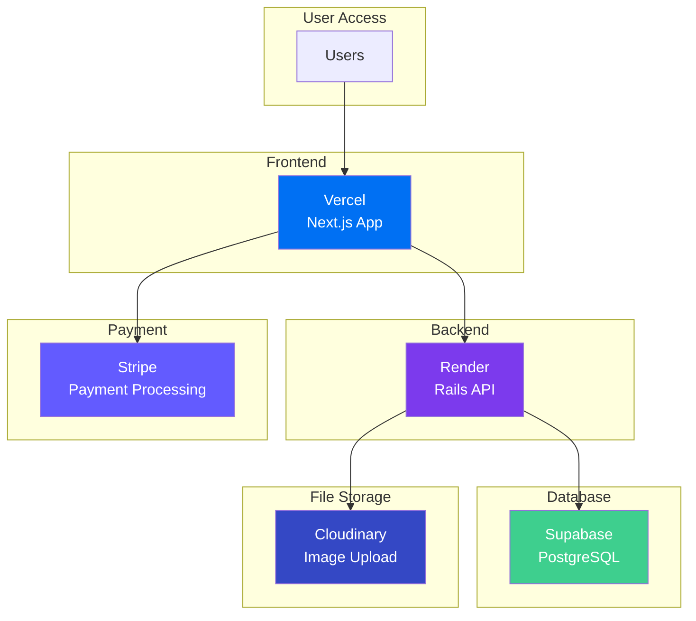
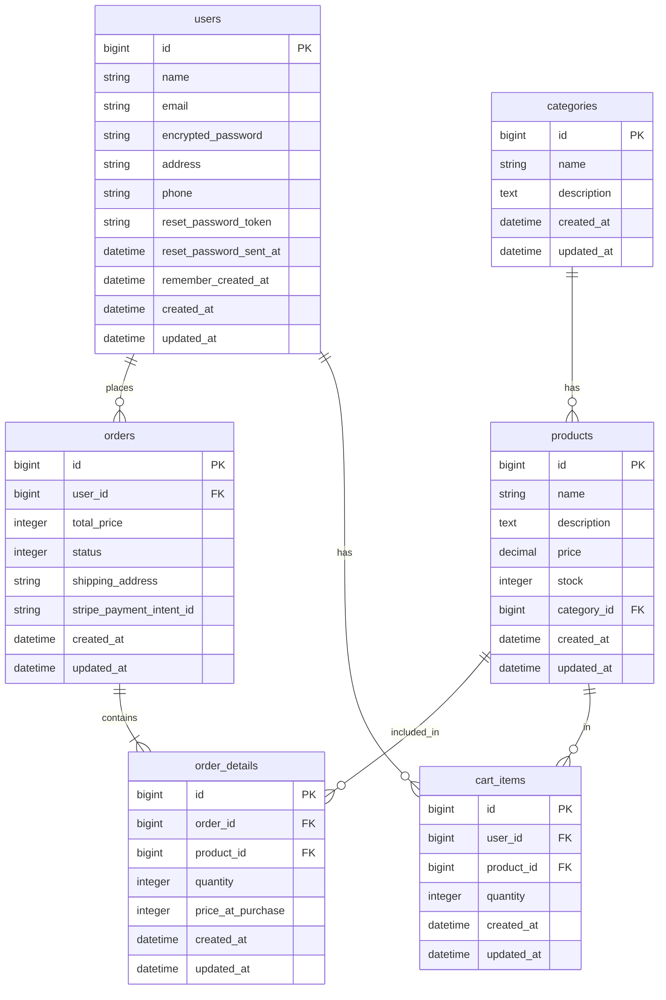

## Portfolio Next.js + Rails + Stripe E-Commerce Site<br>ポートフォリオ Next.js + Rails + Stripe ECサイト

## 1. Production (live app site) 本番環境(公開サイト)

Please visit the live app site on Vercel below.<br>
本アプリを以下のVercelで公開しておりますので是非ご覧ください。<br>
### https://portfolio-next-rails-ecsite.vercel.app

## 2. Overview 概要

This is a full-stack e-commerce application built with Next.js (frontend) and Ruby on Rails (backend), featuring Stripe payment integration.

このアプリケーションは、Next.js（フロントエンド）とRuby on Rails（バックエンド）で構築されたフルスタックECサイトで、Stripe決済機能を備えています。

### Screenshots スクリーンショット

Product list page with categories / カテゴリー別の商品一覧


Product detail page / 商品詳細


Shopping cart with items / 商品選択時のショッピングカート


Stripe checkout integration / Stripeを使用した決済


### Key Features 主な機能

- 🛍️ Product catalog with categories / カテゴリー別商品カタログ
- 🛒 Shopping cart functionality / ショッピングカート機能
- 💳 Stripe payment integration / Stripeによる決済機能
- 👤 User authentication (login/signup) / ユーザー認証（ログイン/新規登録）
- 📱 Responsive design / レスポンシブデザイン
- 🔒 JWT-based API authentication / JWTによるAPI認証

### Tech Stack 技術スタック

**Frontend:**
- Next.js 15.3.3 with App Router
- TypeScript 5.8.3
- Redux Toolkit for state management
- Tailwind CSS 4 for styling
- Stripe React components

**Backend:**
- Ruby on Rails 7.1.5 (API mode)
- PostgreSQL database
- JWT authentication with Devise
- Active Storage + Cloudinary
- RSpec for testing

**Deployment:**
- Frontend: Vercel (Next.js)
- Backend: Render (Rails)
- Database: Supabase (PostgreSQL)

### Production Architecture 本番環境アーキテクチャ



### 

## 3. Local Development Setup ローカル開発環境設定

### Setup Steps セットアップ手順

1.  **Clone the repository リポジトリをクローン**
    ```bash
    git clone git@github.com:tomooshima0828/portfolio-next-rails-ecsite.git
    cd portfolio-next-rails-ecsite
    ```

2.  **Install frontend dependencies フロントエンドの依存関係をインストール**
    ```bash
    cd frontend
    npm install
    cd ..
    ```
    *   **Note:** Ensure your Node.js version meets the project requirements (e.g., v18.18.0 or higher, as indicated by package warnings).
    *   **注意:** Node.jsのバージョンがプロジェクトの要件（パッケージの警告で示されるv18.18.0以上など）を満たしていることを確認してください。

3.  **Build and run the containers コンテナを構築して起動**
    *   This will start the backend and frontend servers.
    *   これにより、バックエンドとフロントエンドのサーバーが起動します。
    ```bash
    docker compose build
    docker compose up -d
    ```

4.  **Set up the database データベースをセットアップ**
    *   This command creates the database, runs migrations, and populates it with initial data all at once.
    *   データベースの作成、マイグレーションの実行、初期データの投入を一度に行います。
    ```bash
    docker compose exec backend bin/rails db:setup
    ```

5.  **Access the application アプリケーションにアクセス**
    *   Frontend / フロントエンド: <a href="http://localhost:3000" target="_blank">http://localhost:3000</a>
    *   Backend API (for reference) / バックエンド API (参考): <a href="http://localhost:3001" target="_blank">http://localhost:3001</a>

### Database Connection データベース接続

DBeaverなどのデータベースクライアントツールで接続する場合は以下の情報を使用してください。

**Local Development Database:**
- **Host**: `localhost`
- **Port**: 5432
- **Database**: `portfolio_development`
- **Username**: `postgres`
- **Password**: `password`

*Note: These credentials are only available after running `docker compose up -d`*

### Linting リント

*   Please run the commands in the root directory of the project.
*   コマンドはプロジェクトのルートディレクトリで実行してください。

```bash
# backend (Rubocop)
docker compose run --rm backend bundle exec rubocop -A

# frontend (ESLint)
docker compose run --rm frontend npm run lint
```

## 4. Requirements Specification 要件仕様

詳細な要件仕様については以下のドキュメントを参照してください：
For detailed requirements specification, please refer to the following document:

📋 **[Requirements Specification 要件定義書](docs/specifications/requirements_specification.md)**

## 5. Technology Selection 技術選定

### Frontend Technology Choices

| Technology | Version | Purpose | Reason for Selection |
|------------|---------|---------|---------------------|
| **Next.js** | 15.3.3 | React Framework | Modern React framework for SPA development<br/>SPA開発向けのモダンなReactフレームワーク |
| **TypeScript** | 5.8.3 | Type Safety | Enhanced code reliability and developer experience<br/>コード品質向上と開発者体験の改善 |
| **Redux Toolkit** | 2.8.2 | State Management | Predictable state management with concise code<br/>簡潔な記述で予測が可能な状態管理 |
| **Tailwind CSS** | 4.0 | Styling | No need to create separate CSS files, rapid development<br/>CSSファイルを別途作成する必要が無く素早く開発が可能 |
| **react-stripe-js** | 3.7.0 | Payment UI | Secure, PCI-DSS-compliant payment components<br/>安全でPCI-DSS準拠の決済コンポーネント |

### Backend Technology Choices

| Technology | Version | Purpose | Reason for Selection |
|------------|---------|---------|---------------------|
| **Ruby on Rails** | 7.1.5 | API Framework | Mature MVC framework, convention over configuration<br/>成熟したMVCフレームワーク、設定より規約 |
| **PostgreSQL** | 15 | Database | Fully supported by Supabase for seamless database deployment<br/>Supabaseで完全サポートされており、データベースデプロイが容易 |
| **Devise + JWT** | 4.9 + 0.10 | Authentication | User login/signup system with secure token authentication<br/>ユーザーログイン・新規登録システム、安全なトークン認証 |
| **RSpec** | 6.1 | Testing | Ruby standard testing framework for reliable code<br/>Rubyの標準的なテストフレームワーク、コードの信頼性向上 |
| **Stripe** | 12.0 | Payment Processing | Secure and easy-to-implement payment system<br/>安全で実装が簡単な決済システム |

### Development & Deployment Strategy

- **Development Environment**: Docker Compose for consistent local development
- **Code Quality**: ESLint + TypeScript (Frontend), RuboCop + RSpec (Backend)  
- **CI/CD**: GitHub Actions with automatic deployment
- **Infrastructure**: Multi-service architecture (Vercel + Render + Supabase)
- **File Storage**: Cloudinary for optimized image handling

## 6. Project Management プロジェクト管理

### GitHub project with issues
Phase 1: Core Features (MVP) コア機能<br>
https://github.com/users/tomooshima0828/projects/1

### Documentation 文書

**🎯 [Issues 課題管理](docs/issues/)**
- [001: Development Environment Setup / 開発環境構築](docs/issues/001_setup_development_environment.md)
- [002: User Authentication Implementation / ユーザー認証実装](docs/issues/002_implement_user_authentication.md)
- [003: Deployment and CI/CD Setup / デプロイとCI/CD構築](docs/issues/003_deploy_and_setup_ci_cd.md)
- [004: Product Display Features / 商品表示機能](docs/issues/004_product_display.md)
- [005: Shopping Cart Implementation / ショッピングカート実装](docs/issues/005_implement_shopping_cart.md)
- [006: Payment Feature Implementation / 決済機能実装](docs/issues/006_implement_payment_feature.md)

**📐 [Specifications / 仕様書](docs/specifications/)**
- [Requirements Specification / 要件定義書](docs/specifications/requirements_specification.md)
- [API Specification / API仕様書](docs/specifications/api_specification.md)
- [Database Schema / データベース設計](docs/specifications/database_schema.md)
- [ER Diagram / ER図](docs/specifications/er_diagram.md)
- [Implementation Plan / 実装計画](docs/specifications/implementation_plan.md)
- [Production Architecture / 本番環境アーキテクチャ](docs/specifications/production_architecture.md)

**📚 [References / 技術参考資料](docs/references/)**
- [Authentication Flow Documentation / 認証フロー](docs/references/002_authentication_flow.md)
- [Devise Integration Guide / Rails Deviseガイド](docs/references/002_devise_overview.md)
- [Frontend Context Providers Data Flow](docs/references/002_frontend_context_providers_flow.md)
- [Deployment Procedures / デプロイ手順](docs/references/003_deployment_procedure.md)
- [Redux Deep Dive / Redux詳細解説](docs/references/005_redux_deep_dive.md)
- [PostgreSQL prepared statements and deallocate](docs/references/005_postgresql_prepared_statements_and_deallocate.md)

### Branch Naming Convention ブランチ命名規則

```
{type}/{issue-number}-{slug-form-issue-title}
```

#### Branch Types ブランチの種類

| Type / 種類 | Purpose / 目的 | Example / 例 |
|-------------|----------------|--------------|
| `feature/` | New feature development / 新機能開発 | `feature/001-user-authentication` |
| `bugfix/`  | Bug fixes / バグ修正 | `bugfix/012-fix-login-error` |
| `hotfix/`  | Critical production fixes / 緊急の本番バグ修正 | `hotfix/015-fix-payment-issue` |
| `refactor/`| Code refactoring / リファクタリング | `refactor/020-improve-api-performance` |
| `docs/`    | Documentation updates / ドキュメント更新 | `docs/025-update-readme` |
| `chore/`   | Maintenance tasks / その他のメンテナンス | `chore/030-update-dependencies` |


## 7. Database Design データベース設計

### Database Schema Documentation データベーススキーマ テーブル定義書
### users
ユーザー情報を格納します。

| カラム名 | データ型 | 説明 |
| --- | --- | --- |
| id | bigint | 主キー |
| name | string | 氏名 |
| email | string | メールアドレス (ユニーク) |
| password_digest | string | ハッシュ化されたパスワード (Railsのhas_secure_password用) |
| address | string | 住所 |
| created_at | datetime | 作成日時 |
| updated_at | datetime | 更新日時 |

### products
商品情報を格納します。

| カラム名 | データ型 | 説明 |
| --- | --- | --- |
| id | bigint | 主キー |
| name | string | 商品名 |
| description | text | 商品説明 |
| price | integer | 価格 |
| stock | integer | 在庫数 |
| category_id | bigint | カテゴリID (外部キー) |
| created_at | datetime | 作成日時 |
| updated_at | datetime | 更新日時 |

### categories
商品カテゴリを格納します。

| カラム名 | データ型 | 説明 |
| --- | --- | --- |
| id | bigint | 主キー |
| name | string | カテゴリ名 (ユニーク) |
| created_at | datetime | 作成日時 |
| updated_at | datetime | 更新日時 |

### orders
注文のヘッダー情報を格納します。

| カラム名 | データ型 | 説明 |
| --- | --- | --- |
| id | bigint | 主キー |
| user_id | bigint | ユーザーID (外部キー) |
| total_price | integer | 合計金額 |
| status | integer | 注文ステータス (例: 0:入金待ち, 1:発送準備中, 2:発送済み) |
| shipping_address | string | 配送先住所 |
| stripe_payment_intent_id | string | Stripe決済ID |
| created_at | datetime | 作成日時 |
| updated_at | datetime | 更新日時 |

### order_details
注文の明細情報を格納します。中間テーブルです。

| カラム名 | データ型 | 説明 |
| --- | --- | --- |
| id | bigint | 主キー |
| order_id | bigint | 注文ID (外部キー) |
| product_id | bigint | 商品ID (外部キー) |
| quantity | integer | 数量 |
| price_at_purchase | integer | 購入時の商品単価 |
| created_at | datetime | 作成日時 |
| updated_at | datetime | 更新日時 |

### cart_items
ショッピングカート内の商品情報を格納します。

| カラム名 | データ型 | 説明 |
| --- | --- | --- |
| id | bigint | 主キー |
| user_id | bigint | ユーザーID (外部キー) |
| product_id | bigint | 商品ID (外部キー) |
| quantity | integer | 数量 |
| created_at | datetime | 作成日時 |
| updated_at | datetime | 更新日時 |

### ER Diagram Documentation ER図


## 8. Project Structure / プロジェクト構造

```
portfolio-next-rails-ecsite/
├── backend/                         # Rails API (Ruby 3.2.0)
│   ├── app/
│   │   ├── controllers/
│   │   │   ├── api/v1/              # API v1 controllers
│   │   │   │   ├── auth_controller.rb
│   │   │   │   ├── base_controller.rb (JWT auth)
│   │   │   │   ├── cart_items_controller.rb
│   │   │   │   ├── categories_controller.rb
│   │   │   │   ├── payment_intents_controller.rb (Stripe)
│   │   │   │   ├── products_controller.rb
│   │   │   │   ├── registrations_controller.rb (Devise)
│   │   │   │   ├── sessions_controller.rb (Devise)
│   │   │   │   └── webhooks_controller.rb (Stripe)
│   │   │   └── concerns/
│   │   └── models/
│   │       ├── user.rb (Devise + JWT)
│   │       ├── product.rb (Active Storage)
│   │       ├── category.rb
│   │       ├── cart_item.rb
│   │       └── order.rb
│   ├── config/
│   │   ├── initializers/
│   │   │   ├── devise.rb & devise_jwt.rb
│   │   │   ├── cors.rb
│   │   │   └── stripe.rb
│   │   └── routes.rb
│   ├── db/
│   │   ├── migrate/ (8 migrations)
│   │   ├── seeds.rb
│   │   └── schema.rb
│   ├── spec/                        # RSpec testing
│   │   ├── factories/
│   │   ├── models/
│   │   └── requests/
│   ├── Dockerfile & Dockerfile.dev
│   └── Gemfile (44 dependencies)
├── frontend/                        # Next.js App (TypeScript 5.8.3)
│   ├── src/
│   │   ├── app/ (App Router)
│   │   │   ├── admin/products/new/  # Admin product creation
│   │   │   ├── cart/                # Shopping cart page
│   │   │   ├── checkout/            # Stripe checkout & success
│   │   │   ├── login/ & signup/     # Authentication pages
│   │   │   ├── mypage/              # User dashboard
│   │   │   ├── products/[id]/       # Dynamic product detail
│   │   │   ├── layout.tsx           # Root layout
│   │   │   └── page.tsx             # Homepage
│   │   ├── components/
│   │   │   ├── cart/                # Cart components
│   │   │   │   ├── AddToCartButton.tsx
│   │   │   │   ├── CartIcon.tsx
│   │   │   │   └── CartSummary.tsx
│   │   │   ├── layout/              # Header & Footer
│   │   │   ├── products/            # Product components
│   │   │   ├── CheckoutForm.tsx     # Stripe integration
│   │   │   └── StripeProvider.tsx
│   │   ├── contexts/
│   │   │   └── AuthContext.tsx      # JWT auth context
│   │   ├── features/
│   │   │   └── cart/
│   │   │       └── cartSlice.ts     # Redux Toolkit
│   │   ├── lib/
│   │   │   └── apiClient.ts         # Axios API client
│   │   └── store/
│   │       └── store.ts             # Redux store
│   ├── public/
│   │   └── favicon.ico
│   ├── package.json (21 dependencies)
│   └── Dockerfile
├── docs/
│   ├── images/                      # README screenshots
│   │   ├── product-list.png
│   │   ├── product-detail.png
│   │   ├── shopping-cart.png
│   │   └── checkout.png
│   ├── issues/                      # Development issues
│   │   ├── 001-006_*.md (6 issues)
│   │   └── implementation tracking
│   ├── references/                  # Technical documentation
│   └── specifications/              # Architecture docs
│       ├── api_specification.md
│       ├── database_schema.md
│       ├── er_diagram.md & .svg
│       ├── implementation_plan.md
│       └── requirements_specification.md
├── docker-compose.yml               # PostgreSQL + Rails + Next.js
├── vercel.json                      # Vercel deployment config
├── CLAUDE.md                        # AI assistant instructions
└── README.md
```
