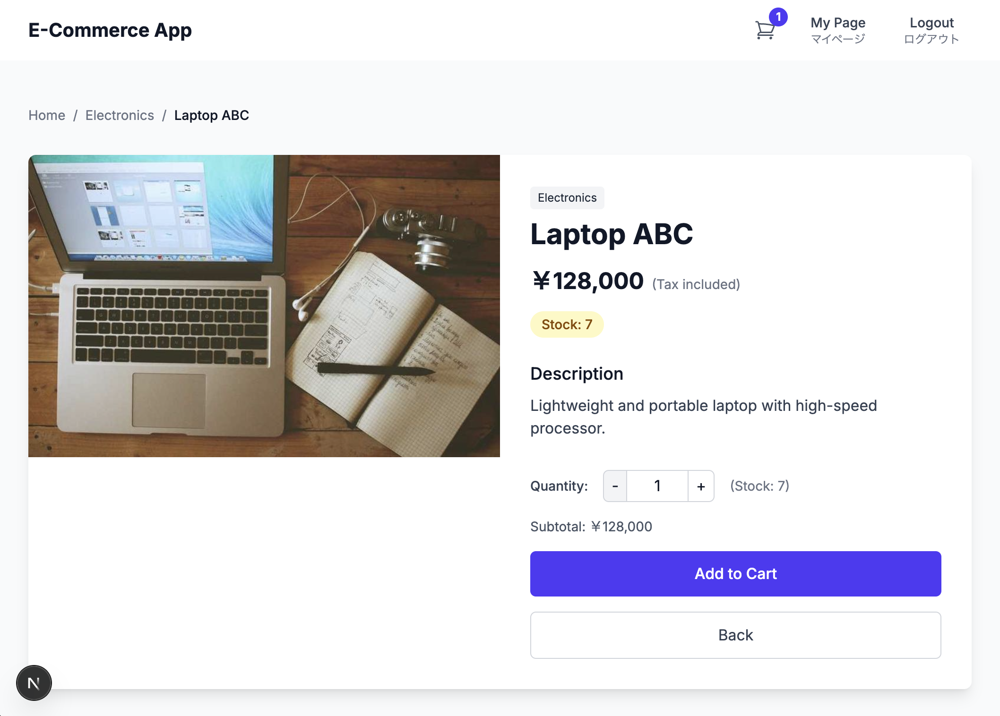
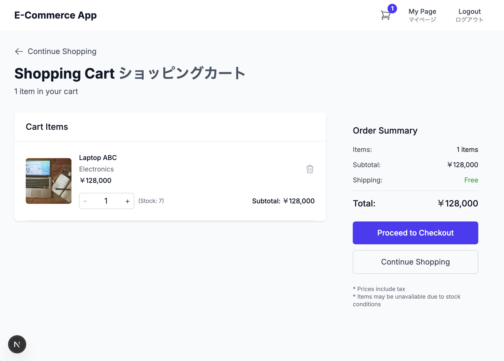
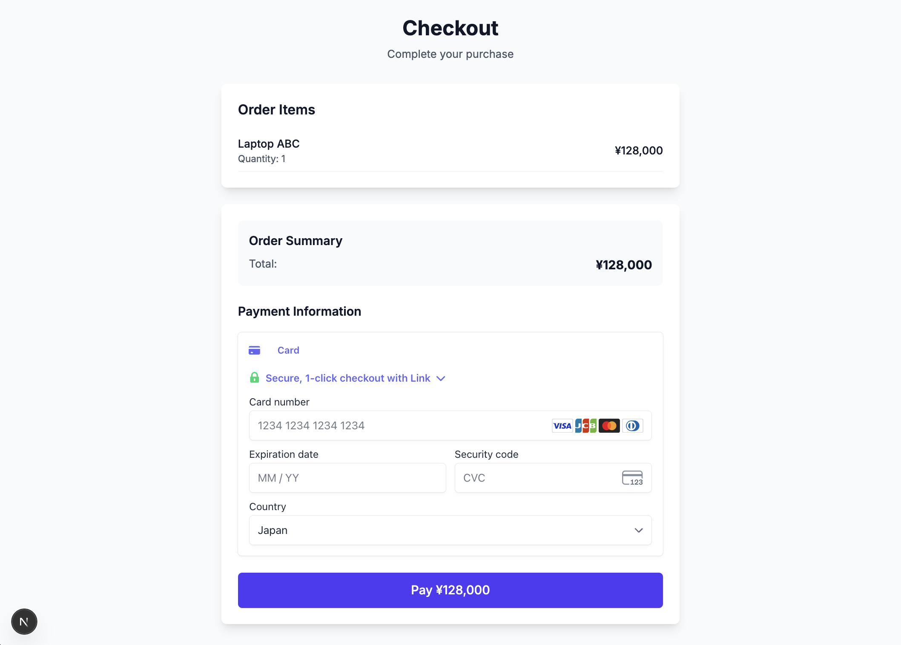

# portfolio-next-rails-ecsite
## ポートフォリオ Next.js + Rails ECサイト

## Live Site on Vercel
https://portfolio-next-rails-ecsite.vercel.app

## 1. Overview / 概要

This is a full-stack e-commerce application built with Next.js (frontend) and Ruby on Rails (backend), featuring Stripe payment integration.

このアプリケーションは、Next.js（フロントエンド）とRuby on Rails（バックエンド）で構築されたフルスタックECサイトで、Stripe決済機能を備えています。

### Screenshots / スクリーンショット

*Product list page with categories / カテゴリー別商品一覧ページ*


*Product detail page / 商品詳細ページ*


*Shopping cart with items / 商品が入ったショッピングカート*


*Stripe checkout integration / Stripe決済画面統合*


### Key Features / 主な機能

- 🛍️ Product catalog with categories / カテゴリー別商品カタログ
- 🛒 Shopping cart functionality / ショッピングカート機能
- 💳 Stripe payment integration / Stripe決済統合
- 👤 User authentication (login/signup) / ユーザー認証（ログイン/新規登録）
- 📱 Responsive design / レスポンシブデザイン
- 🔒 JWT-based API authentication / JWT ベースのAPI認証

### Tech Stack / 技術スタック

**Frontend:**
- Next.js 15.3.3 with App Router
- TypeScript 5.8.3
- Redux Toolkit for state management
- Tailwind CSS 4 for styling
- Stripe React components

**Backend:**
- Ruby on Rails 7.1.5 (API mode)
- PostgreSQL database
- JWT authentication with Devise
- Active Storage + Cloudinary
- RSpec for testing

**Deployment:**
- Frontend: Vercel (Next.js)
- Backend: Render (Rails)
- Database: Supabase (PostgreSQL)

## 2. Local Development Setup / ローカル開発環境設定

### Setup Steps / セットアップ手順

1.  **Clone the repository / リポジトリをクローン**
    ```bash
    git clone git@github.com:tomooshima0828/portfolio-next-rails-ecsite.git
    cd portfolio-next-rails-ecsite
    ```

2.  **Install frontend dependencies / フロントエンドの依存関係をインストール**
    ```bash
    cd frontend
    npm install
    cd ..
    ```
    *   **Note:** Ensure your Node.js version meets the project requirements (e.g., v18.18.0 or higher, as indicated by package warnings).
    *   **注意:** Node.jsのバージョンがプロジェクトの要件（パッケージの警告で示されるv18.18.0以上など）を満たしていることを確認してください。

3.  **Build and run the containers / コンテナを構築して起動**
    *   This will start the backend and frontend servers.
    *   これにより、バックエンドとフロントエンドのサーバーが起動します。
    ```bash
    docker compose build
    docker compose up -d
    ```

4.  **Set up the database / データベースをセットアップ**
    *   This command creates the database, runs migrations, and populates it with initial data all at once.
    *   データベースの作成、マイグレーションの実行、初期データの投入を一度に行います。
    ```bash
    docker compose exec backend bin/rails db:setup
    ```

5.  **Access the application / アプリケーションにアクセス**
    *   Frontend / フロントエンド: [http://localhost:3000](http://localhost:3000)
    *   Backend API (for reference) / バックエンド API (参考): [http://localhost:3001](http://localhost:3001)

### Database Connection / データベース接続

DBeaverなどのデータベースクライアントツールで接続する場合は以下の情報を使用してください。

**Local Development Database:**
- **Host**: `localhost`
- **Port**: 5432
- **Database**: `portfolio_development`
- **Username**: `postgres`
- **Password**: `password`

*Note: These credentials are only available after running `docker compose up -d`*

### Linting / リント

*   Please run the commands in the root directory of the project.
*   コマンドはプロジェクトのルートディレクトリで実行してください。

```bash
# backend (Rubocop)
docker compose run --rm backend bundle exec rubocop -A

# frontend (ESLint)
docker compose run --rm frontend npm run lint
```

## 3. Requirements Specification / 要件仕様

詳細な要件仕様については以下のドキュメントを参照してください：
For detailed requirements specification, please refer to the following document:

📋 **[Requirements Specification 要件定義書](docs/specifications/requirements_specification.md)**

## 4. Technology Selection / 技術選定

This project adopts a modern **decoupled architecture** with carefully selected technologies for scalability, maintainability, and developer experience.

このプロジェクトでは、スケーラビリティ、保守性、開発者体験を重視して慎重に選定された技術により、モダンな**疎結合アーキテクチャ**を採用しています。

### Frontend Technology Choices

| Technology | Version | Purpose | Reason for Selection |
|------------|---------|---------|---------------------|
| **Next.js** | 15.3.3 | React Framework | Modern React framework for SPA development<br/>SPA開発向けのモダンなReactフレームワーク |
| **TypeScript** | 5.8.3 | Type Safety | Enhanced code reliability and developer experience<br/>コード品質向上と開発者体験の改善 |
| **Redux Toolkit** | 2.8.2 | State Management | Predictable state management with concise code<br/>簡潔な記述で予測が可能な状態管理 |
| **Tailwind CSS** | 4.0 | Styling | No need to create separate CSS files, rapid development<br/>CSSファイルを別途作成する必要が無く素早く開発が可能 |
| **react-stripe-js** | 3.7.0 | Payment UI | Secure, PCI-DSS-compliant payment components<br/>安全でPCI-DSS準拠の決済コンポーネント |

### Backend Technology Choices

| Technology | Version | Purpose | Reason for Selection |
|------------|---------|---------|---------------------|
| **Ruby on Rails** | 7.1.5 | API Framework | Mature MVC framework, convention over configuration<br/>成熟したMVCフレームワーク、設定より規約 |
| **PostgreSQL** | 15 | Database | Fully supported by Supabase for seamless database deployment<br/>Supabaseで完全サポートされており、データベースデプロイが容易 |
| **Devise + JWT** | 4.9 + 0.10 | Authentication | User login/signup system with secure token authentication<br/>ユーザーログイン・新規登録システム、安全なトークン認証 |
| **RSpec** | 6.1 | Testing | Ruby standard testing framework for reliable code<br/>Rubyの標準的なテストフレームワーク、コードの信頼性向上 |
| **Stripe** | 12.0 | Payment Processing | Secure and easy-to-implement payment system<br/>安全で実装が簡単な決済システム |

### Development & Deployment Strategy

- **Development Environment**: Docker Compose for consistent local development
- **Code Quality**: ESLint + TypeScript (Frontend), RuboCop + RSpec (Backend)  
- **CI/CD**: GitHub Actions with automatic deployment
- **Infrastructure**: Multi-service architecture (Vercel + Render + Supabase)
- **File Storage**: Cloudinary for optimized image handling

## 5. Database Schema / データベーススキーマ
Please see the database schema below.
詳細なデータベーススキーマ定義については、こちらをご確認ください：

📋**[Database Schema Documentation データベーススキーマ テーブル定義書](docs/specifications/database_schema.md)**

## 6. ER Diagram / ER図
Please see the ER diagram below.
詳細なER図については、こちらをご確認ください：

📋**[ER Diagram Documentation ER図](docs/specifications/er_diagram.md)**

## 7. Development Workflow / 開発ワークフロー

### Branch Naming Convention / ブランチ命名規則

```
{type}/{issue-number}-{slug-form-title}
```

#### Branch Types / ブランチの種類

| Type / 種類 | Purpose / 目的 | Example / 例 |
|-------------|----------------|--------------|
| `feature/` | New feature development / 新機能開発 | `feature/001-user-authentication` |
| `bugfix/`  | Bug fixes / バグ修正 | `bugfix/012-fix-login-error` |
| `hotfix/`  | Critical production fixes / 緊急の本番バグ修正 | `hotfix/015-fix-payment-issue` |
| `refactor/`| Code refactoring / リファクタリング | `refactor/020-improve-api-performance` |
| `docs/`    | Documentation updates / ドキュメント更新 | `docs/025-update-readme` |
| `chore/`   | Maintenance tasks / その他のメンテナンス | `chore/030-update-dependencies` |

#### Naming Rules / 命名規則

1. **Use slashes (/) to separate branch types**  
   **スラッシュ(/)でブランチタイプを区切る**  
   - 例: `feature/001-user-authentication`

2. **Prefix with issue number**  
   **Issue番号を先頭に付与**  
   - 例: `001-` (3桁のゼロパディング)
   - Issue番号がない場合は `000-` から開始

3. **Slug-form title**  
   **スラッグ形式のタイトル**  
   - 小文字の英数字とハイフンのみ使用
   - 単語はハイフンで区切る
   - 例: `setup-docker-environment`

### Basic Workflow / 基本的なワークフロー

1. **Start a new feature** / **新機能の作業を開始**:
   ```bash
   git checkout main
   git pull origin main
   git checkout -b feature/001-user-authentication
   ```

2. **Commit changes** / **変更をコミット**:
   ```bash
   git add .
   git commit -m "feat: Implement input fields for user authentication"
   ```

3. **Push to remote** / **リモートにプッシュ**:
   ```bash
   git push -u origin feature/001-user-authentication
   ```

4. **Create a pull request** / **プルリクエストを作成**:
   - Create a pull request on GitHub/GitLab
   - Reference related issue (e.g., `#1`)
   - Get code review and merge

## 8. Issue Management / Issue管理方針

### Naming Convention / 命名規則
- File Name: `{issue-number}-{slug-form-title}.md`
  - Example: `001-setup-development-environment.md`

## 9. Project Structure / プロジェクト構造

```
portfolio-next-rails-ecsite/
├── backend/                         # Rails API (Ruby 3.2.0)
│   ├── app/
│   │   ├── controllers/
│   │   │   ├── api/v1/              # API v1 controllers
│   │   │   │   ├── auth_controller.rb
│   │   │   │   ├── base_controller.rb (JWT auth)
│   │   │   │   ├── cart_items_controller.rb
│   │   │   │   ├── categories_controller.rb
│   │   │   │   ├── payment_intents_controller.rb (Stripe)
│   │   │   │   ├── products_controller.rb
│   │   │   │   ├── registrations_controller.rb (Devise)
│   │   │   │   ├── sessions_controller.rb (Devise)
│   │   │   │   └── webhooks_controller.rb (Stripe)
│   │   │   └── concerns/
│   │   └── models/
│   │       ├── user.rb (Devise + JWT)
│   │       ├── product.rb (Active Storage)
│   │       ├── category.rb
│   │       ├── cart_item.rb
│   │       └── order.rb
│   ├── config/
│   │   ├── initializers/
│   │   │   ├── devise.rb & devise_jwt.rb
│   │   │   ├── cors.rb
│   │   │   └── stripe.rb
│   │   └── routes.rb
│   ├── db/
│   │   ├── migrate/ (8 migrations)
│   │   ├── seeds.rb
│   │   └── schema.rb
│   ├── spec/                        # RSpec testing
│   │   ├── factories/
│   │   ├── models/
│   │   └── requests/
│   ├── Dockerfile & Dockerfile.dev
│   └── Gemfile (44 dependencies)
├── frontend/                        # Next.js App (TypeScript 5.8.3)
│   ├── src/
│   │   ├── app/ (App Router)
│   │   │   ├── admin/products/new/  # Admin product creation
│   │   │   ├── cart/                # Shopping cart page
│   │   │   ├── checkout/            # Stripe checkout & success
│   │   │   ├── login/ & signup/     # Authentication pages
│   │   │   ├── mypage/              # User dashboard
│   │   │   ├── products/[id]/       # Dynamic product detail
│   │   │   ├── layout.tsx           # Root layout
│   │   │   └── page.tsx             # Homepage
│   │   ├── components/
│   │   │   ├── cart/                # Cart components
│   │   │   │   ├── AddToCartButton.tsx
│   │   │   │   ├── CartIcon.tsx
│   │   │   │   └── CartSummary.tsx
│   │   │   ├── layout/              # Header & Footer
│   │   │   ├── products/            # Product components
│   │   │   ├── CheckoutForm.tsx     # Stripe integration
│   │   │   └── StripeProvider.tsx
│   │   ├── contexts/
│   │   │   └── AuthContext.tsx      # JWT auth context
│   │   ├── features/
│   │   │   └── cart/
│   │   │       └── cartSlice.ts     # Redux Toolkit
│   │   ├── lib/
│   │   │   └── apiClient.ts         # Axios API client
│   │   └── store/
│   │       └── store.ts             # Redux store
│   ├── public/
│   │   └── favicon.ico
│   ├── package.json (21 dependencies)
│   └── Dockerfile
├── docs/
│   ├── images/                      # README screenshots
│   │   ├── product-list.png
│   │   ├── product-detail.png
│   │   ├── shopping-cart.png
│   │   └── checkout.png
│   ├── issues/                      # Development issues
│   │   ├── 001-006_*.md (6 issues)
│   │   └── implementation tracking
│   ├── references/                  # Technical documentation
│   └── specifications/              # Architecture docs
│       ├── api_specification.md
│       ├── database_schema.md
│       ├── er_diagram.md & .svg
│       ├── implementation_plan.md
│       └── requirements_specification.md
├── docker-compose.yml               # PostgreSQL + Rails + Next.js
├── vercel.json                      # Vercel deployment config
├── CLAUDE.md                        # AI assistant instructions
└── README.md
```
