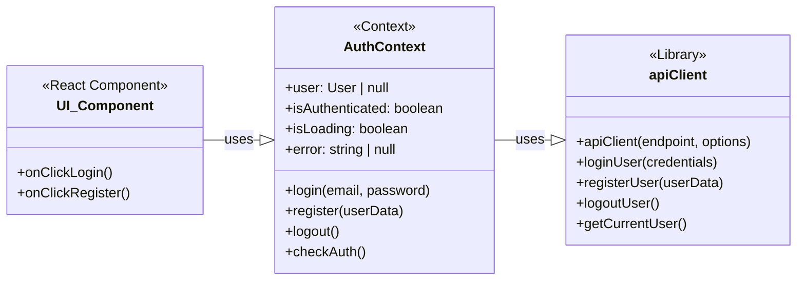
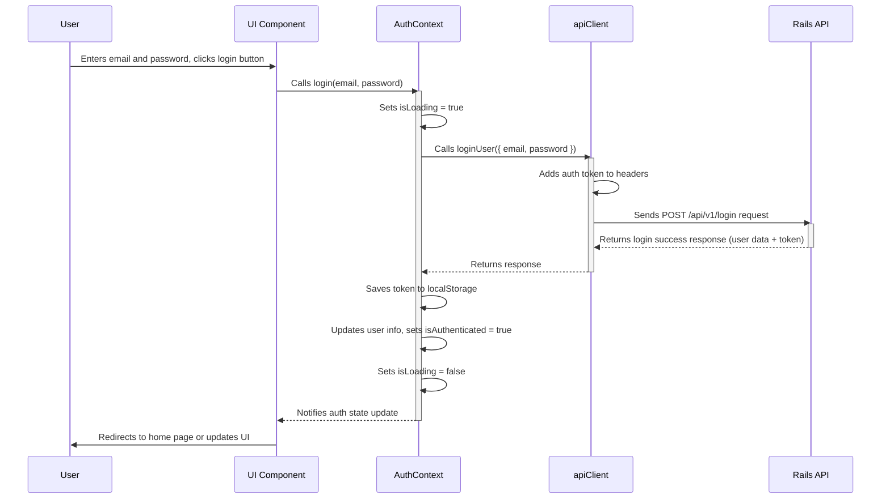

# Authentication Flow Architecture

## 1. Component Roles and Separation of Concerns

This diagram illustrates the roles and relationships between the main components involved in the authentication flow.

## 2. Login Sequence Flow

This sequence diagram shows the detailed flow when a user attempts to log in.

## Key Points

1. **Separation of Concerns**:
   - UI Components handle user interactions
   - AuthContext manages authentication state and business logic
   - apiClient handles API communication details

2. **Data Flow**:
   - Unidirectional data flow from UI → Context → API Client → Server
   - State updates flow back through the same chain

3. **Error Handling**:
   - Errors are caught and handled at each appropriate level
   - UI receives updates about loading and error states
