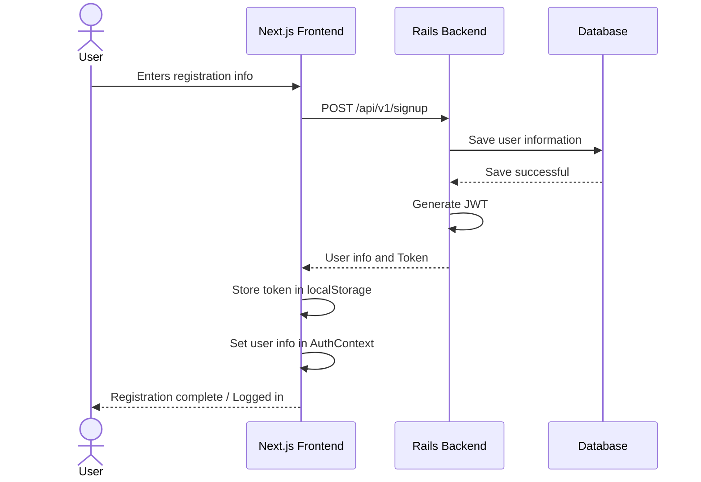
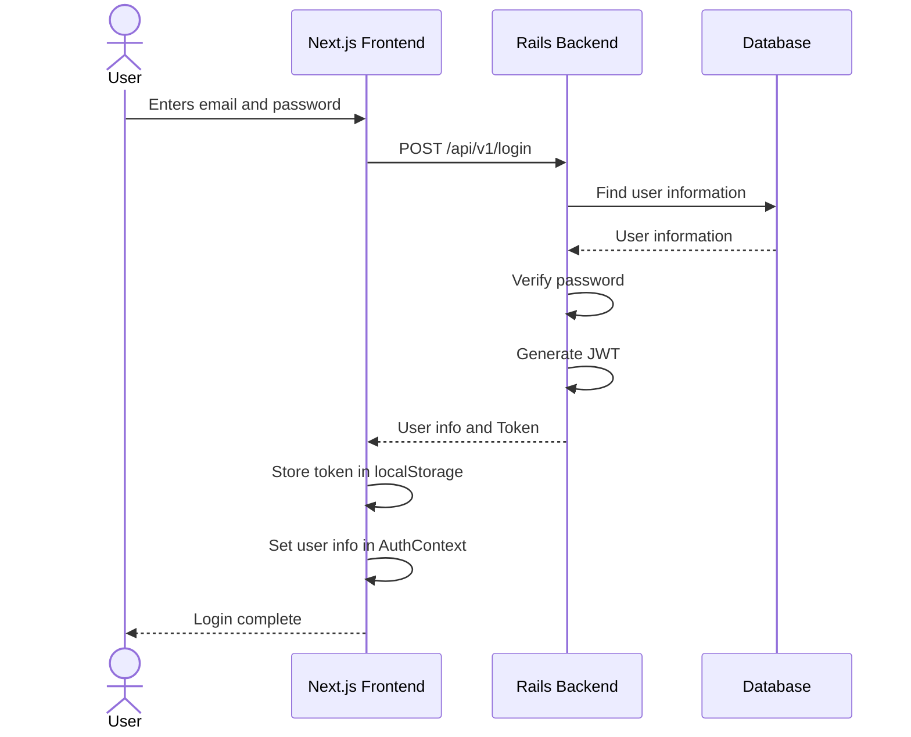
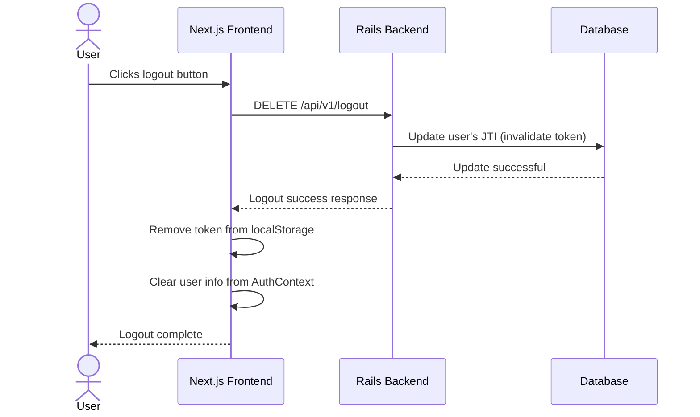
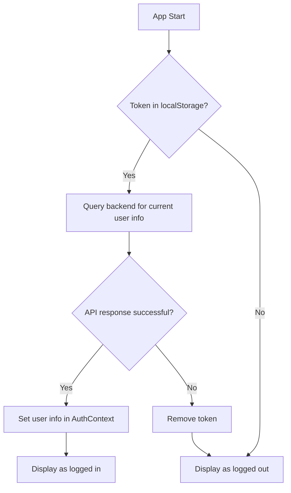

# Authentication Flow Diagram / 認証フローの図解

This document illustrates the user authentication flow in the e-commerce site.
このドキュメントでは、ECサイトにおけるユーザー認証の流れを図解します。

## Table of Contents / 目次

1.  [User Registration Flow](#user-registration-flow--ユーザー登録フロー)
2.  [Login Flow](#login-flow--ログインフロー)
3.  [Logout Flow](#logout-flow--ログアウトフロー)
4.  [Authentication Check on Application Start](#authentication-check-on-application-start--アプリケーション起動時の認証チェック)
5.  [Why JWT is Optimal](#why-jwt-is-optimal--なぜjwt認証が最適なのか)
6.  [Technical Details of JWT Authentication](#technical-details-of-jwt-authentication--jwt認証の技術的詳細)

## User Registration Flow / ユーザー登録フロー

## Login Flow / ログインフロー

## Logout Flow / ログアウトフロー

## Authentication Check on Application Start / アプリケーション起動時の認証チェック

## Why JWT is Optimal / なぜJWT認証が最適なのか？

This project uses JWT (JSON Web Token) for user authentication. Here are the specific reasons why JWT is superior to other methods (e.g., server-side sessions), especially for the e-commerce architecture (Next.js + Rails API).
このプロジェクトでは、ユーザー認証にJWT（JSON Web Token）を採用しています。他の認証方法（例：サーバーサイドセッション）と比較して、特にこのECサイトのアーキテクチャの構成（Next.js + Rails API）においてJWTが優れている具体的な理由を説明します。

### 1. Keeping the Server "Lightweight" (Statelessness) / サーバーが「身軽」でいられる（ステートレス性）

In traditional session authentication, the server needed to "remember" the information of each logged-in user.
従来のセッション認証では、サーバーはログインしたユーザー一人ひとりの情報を「覚えておく」必要がありました。

-   **With Session Authentication**:
    1.  When a user logs in, the server issues a "session ID".
    2.  The server links this ID to user information and stores it in server memory or a database (e.g., "ID: abcde is User A").
    3.  The user sends the session ID with each request, and the server verifies their identity by checking it against its memory.
-   **セッション認証の場合**:
    1.  ユーザーがログインすると、サーバーは「セッションID」を発行します。
    2.  サーバーは、このIDとユーザー情報を紐づけて、サーバー内のメモリやデータベースに保存します（例：「ID: abcde は ユーザーAさん」）。
    3.  ユーザーはリクエストのたびにセッションIDを送り、サーバーはそれを自分の記憶と照合して本人確認をします。

The challenge with this method is that it becomes complex when scaling out (adding more servers) due to increased traffic. A separate mechanism to share session information across all servers (like a shared database or sticky sessions) is required so that any server can verify user information. 
この方法の課題は、アクセスが増えてサーバーを複数台に増やす（スケールアウトする）際に複雑になることです。どのサーバーがリクエストを受け取ってもユーザー情報を照合できるよう、全サーバーでセッション情報を共有する仕組み（共有データベースやスティッキーセッションなど）が別途必要になります。

-   **With JWT Authentication**:
    1.  When a user logs in, the server issues a JWT containing user information (e.g., user ID) and gives it to the user.
    2.  **The server only needs to remember one thing per user: the ID of their currently valid token (the JTI).** It doesn't need to store the entire session data for every active user.
    3.  The user sends the JWT in the header with each request.
    4.  The server can verify that the token is legitimate and its information has not been tampered with simply by validating the digital signature of the received JWT.
-   **JWT認証の場合**:
    1.  ユーザーがログインすると、サーバーはユーザー情報（例：ユーザーID）を含んだJWTを発行してユーザーに渡します。
    2.  **サーバーはユーザーごとに一つだけ、現在有効なトークンのID（JTI）を覚えておくだけで済みます。** アクティブな全ユーザーのセッション情報全体を保存する必要はありません。
    3.  ユーザーはリクエストのたびにJWTをヘッダーに付けて送ります。
    4.  サーバーは受け取ったJWTの電子署名を検証するだけで、そのトークンが正当であり、中の情報が改ざんされていないことを確認できます。

This eliminates the need for the server to manage a constantly changing session state for every active user. While the JTI mechanism does store a minimal state (the current valid token ID), the architecture remains what is often referred to as "largely stateless," allowing any server to handle requests and making the system much easier to scale. 
これにより、サーバーはアクティブな全ユーザーのセッション状態を常に管理する必要がなくなります。JTIの仕組みは現在の有効なトークンIDという最小限の状態を保持しますが、アーキテクチャとしては「ほぼステートレス」と呼べる状態を維持するため、どのサーバーでもリクエストを処理でき、システムの拡張が非常に容易になります。

### 2. Robustness in Cross-Domain Setups (CORS) / ドメインが異なる構成（CORS）に強い

When the frontend (`localhost:3000`) and backend (`localhost:3001`) operate from different origins, as in this project, the browser's security features (CORS) can be a challenge.
このプロジェクトのように、フロントエンド（`localhost:3000`）とバックエンド（`localhost:3001`）が異なる場所（オリジン）で動作している場合、ブラウザのセキュリティ機能（CORS）が課題となります。

-   **With Cookie-Based Authentication**:
    For security reasons, cookies have strict restrictions on cross-domain interactions. Allowing this requires complex configurations on both the server and client (e.g., `Access-Control-Allow-Credentials`), and misconfigurations can lead to security risks.
-   **Cookieベースの認証の場合**:
    Cookieは、セキュリティ上の理由から、異なるドメイン間でのやり取りに厳しい制約があります。これを許可するためには、サーバーとクライアント双方で複雑な設定（`Access-Control-Allow-Credentials`など）が必要になり、設定ミスがセキュリティリスクに繋がる可能性もあります。

-   **With JWT Authentication**:
    JWTs are typically sent in the `Authorization` header of an HTTP request. This is a standard way to carry credentials and is less susceptible to cookie-like domain restrictions, allowing for simpler and safer authentication implementation in a CORS environment.
-   **JWT認証の場合**:
    JWTは通常、HTTPリクエストの`Authorization`ヘッダーに入れて送信されます。これは「資格情報」を運ぶための標準的な方法であり、Cookieのようなドメイン制約を受けにくいため、CORS環境でもシンプルかつ安全に認証を実装できます。

### 3. Easy to Support Non-Web Clients / Web以外のクライアントにも対応しやすい

In the future, we might consider developing a mobile app version (iOS/Android) of this e-commerce site.
将来的に、このECサイトのモバイルアプリ版（iOS/Android）を開発する可能性も考えられます。

-   **With Cookie-Based Authentication**:
    Since mobile apps are not browsers, cookie handling is not standardized and may require special handling for each platform.
-   **Cookieベースの認証の場合**:
    モバイルアプリはブラウザではないため、Cookieの扱いは標準化されておらず、プラットフォームごとに特別な対応が必要になることがあります。

-   **With JWT Authentication**:
    Adding information to HTTP headers is a basic feature of HTTP client libraries on any platform (Web, iOS, Android, desktop apps). Therefore, the same backend authentication mechanism can be used for both web and mobile apps without any changes.
-   **JWT認証の場合**:
    HTTPヘッダーに情報を追加するのは、どんなプラットフォーム（Web、iOS、Android、デスクトップアプリ）のHTTPクライアントライブラリでも基本機能として備わっています。そのため、バックエンドの認証の仕組みを一切変更することなく、Webアプリでもモバイルアプリでも同じように対応できます。

For these reasons, JWT authentication is the optimal choice for a modern, decoupled architecture like this project, from the perspectives of scalability, maintainability, and security.
以上の理由から、JWT認証は本プロジェクトのようなモダンな分離型アーキテクチャにとって、拡張性、保守性、安全性の観点から最適な選択と言えます。

## Technical Details of JWT Authentication / JWT認証の技術的詳細

### What is JWT? / JWTとは

JWT (JSON Web Token) is a compact, self-contained way for securely transmitting information between parties as a JSON object. This information can be verified and trusted because it is digitally signed.
JWT（JSON Web Token）は、当事者間で安全に情報を送信するためのコンパクトで自己完結型の方法です。この情報は、デジタル署名されているため、検証および信頼できます。

### Structure of a JWT / JWTの構造

A JWT is a string made up of three parts, separated by dots:
JWTは、ドットで区切られた3つの部分からなる文字列です：

1.  **Header** - Token type and algorithm
2.  **Payload** - Claims (data)
3.  **Signature** - Used to verify the token
1.  **ヘッダー** - トークンのタイプとアルゴリズム
2.  **ペイロード** - クレーム（データ）
3.  **署名** - トークンの検証に使用

Example: `xxxxx.yyyyy.zzzzz`
例：`xxxxx.yyyyy.zzzzz`

### Token Invalidation with JTI / JTIによるトークン無効化

JTI (JWT ID) provides a unique identifier for a token, enabling the ability to invalidate it.
JTI（JWT ID）は、トークンに一意の識別子を提供し、そのトークンを無効化する機能を可能にします。

1.  When a user logs in, a unique JTI value is stored in the user record.
2.  This JTI value is included in the token's payload.
3.  When the user logs out, the JTI value in the database is updated.
4.  A token with the old JTI value is considered invalid and will fail authentication.
1.  ユーザーがログインすると、一意のJTI値がユーザーレコードに保存されます
2.  このJTI値がトークンのペイロードに含まれます
3.  ユーザーがログアウトすると、データベース内のJTI値が更新されます
4.  古いJTI値を持つトークンは無効と見なされ、認証に失敗します

This prevents previously issued tokens from being used after the user has logged out.
これにより、ユーザーがログアウトした後でも、以前発行されたトークンが使用できなくなります。