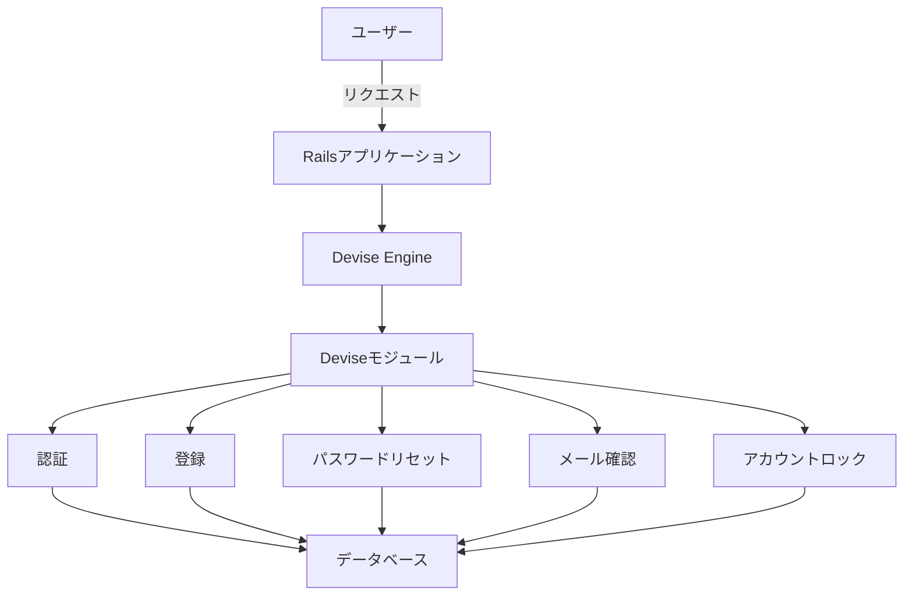
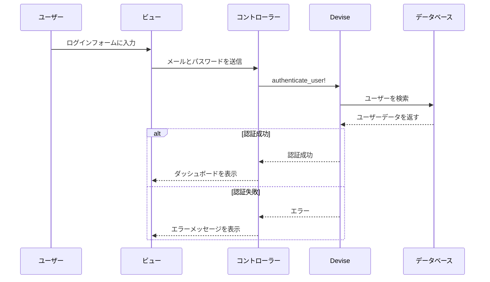
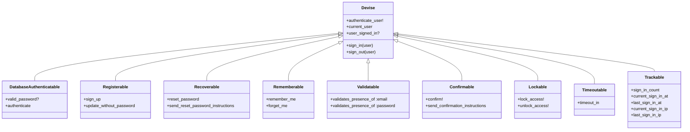
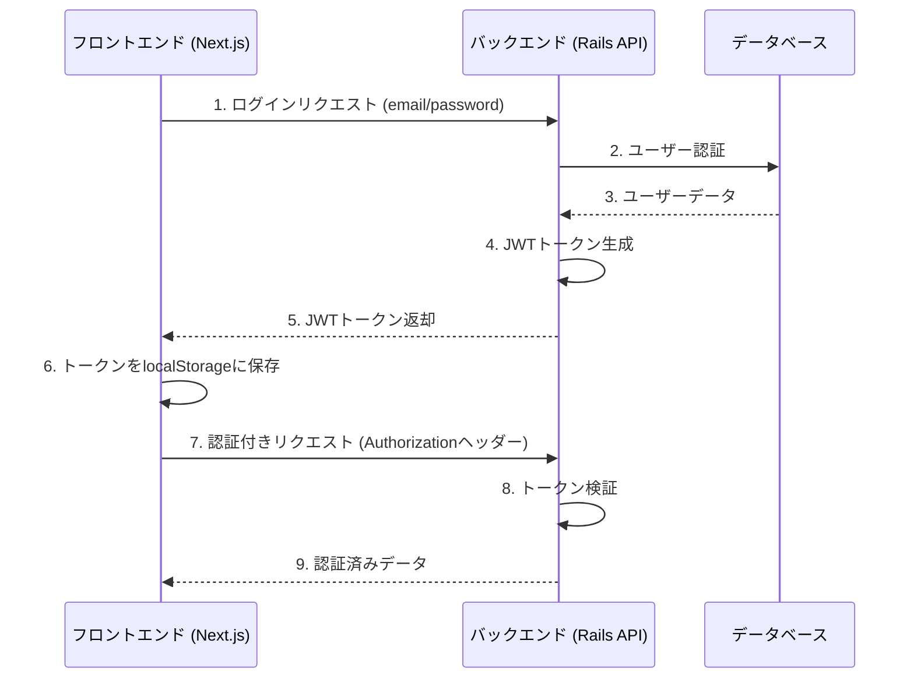

# Devise 認証システムの全体像

このドキュメントでは、Railsアプリケーションで使用されるDevise認証システムの全体像を図解します。

## 1. Deviseの基本アーキテクチャ



## 2. 認証フロー



## 3. Deviseのモジュール構成



## 4. 現在のプロジェクトのJWT認証フロー



## 5. Deviseのディレクトリ構造

```
app/
├── models/
│   └── user.rb                 # DeviseのUserモデル
├── controllers/
│   ├── application_controller.rb
│   └── users/                  # カスタムコントローラー
│       ├── registrations_controller.rb
│       └── sessions_controller.rb
├── views/
│   └── devise/                 # Deviseのビュー
│       ├── sessions/
│       ├── registrations/
│       ├── passwords/
│       └── ...
└── mailers/
    └── user_mailer.rb          # メーラー
```

## 6. 主要な設定ファイル

### 初期化ファイル (`config/initializers/devise.rb`)

```rubn
# メール送信の設定
config.mailer_sender = 'your-email@example.com'


# パスワードの最小長
config.password_length = 6..128

# メール確認の有効期限
config.confirm_within = 3.days

# パスワードリセットの有効期限
config.reset_password_within = 6.hours
```

### ルーティング (`config/routes.rb`)

```ruby
devise_for :users, controllers: {
  sessions: 'users/sessions',
  registrations: 'users/registrations',
  passwords: 'users/passwords'
}
```

## 7. よく使うヘルパーメソッド

### コントローラー内
- `before_action :authenticate_user!` - ログイン必須のアクションを指定
- `current_user` - 現在ログイン中のユーザーを取得
- `user_signed_in?` - ユーザーがログイン中かどうかをチェック
- `sign_in(@user)` - ユーザーをログイン状態にする
- `sign_out(@user)` - ユーザーをログアウト状態にする

### ビュー内
- `user_signed_in?` - ユーザーがログイン中かどうか
- `current_user` - 現在のユーザーオブジェクト
- `user_session` - 現在のセッション情報

## 8. セキュリティに関する注意点

1. **パスワードの取り扱い**
   - パスワードは必ずハッシュ化して保存
   - 平文でのパスワード送信はHTTPSを使用

2. **CSRF対策**
   - APIモードでは`null_session`を使用
   - 通常のWebアプリでは`protect_from_forgery`を有効に

3. **セッション管理**
   - セッションハイジャック対策のため、`config.secret_key_base`を適切に設定
   - セッションタイムアウトの設定を検討

4. **JWTの取り扱い**
   - トークンの有効期限を適切に設定
   - トークンはクライアント側で安全に保管（localStorage/sessionStorage）
   - 必要に応じてリフレッシュトークンを実装

このドキュメントは、Deviseを使用した認証システムの実装と理解をサポートするためのものです。プロジェクトの要件に応じて、適切なカスタマイズを行ってください。
