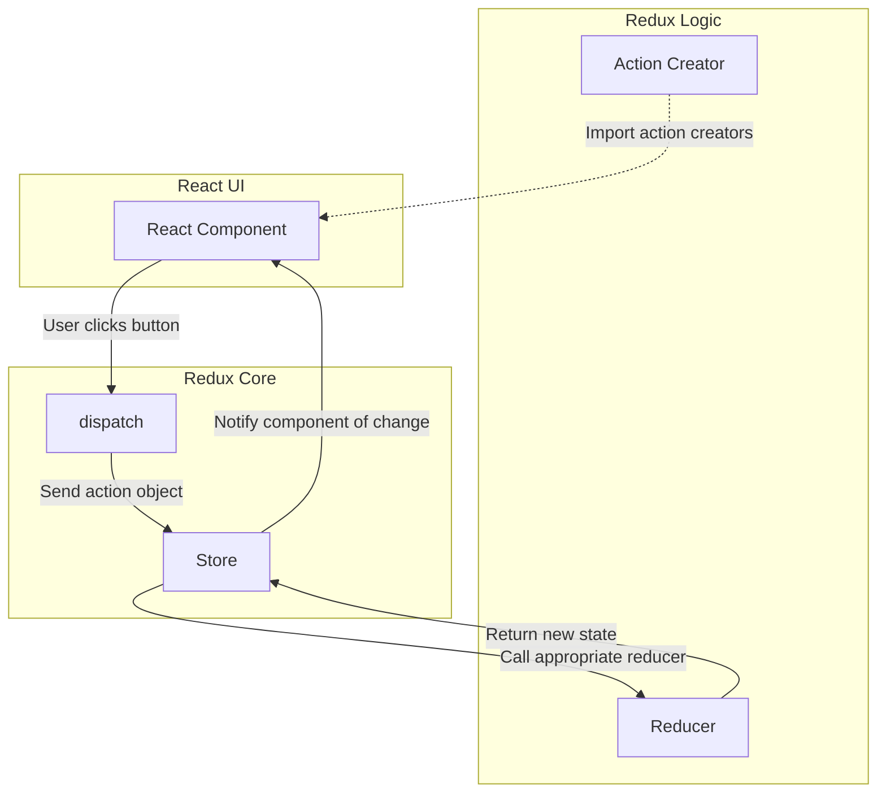
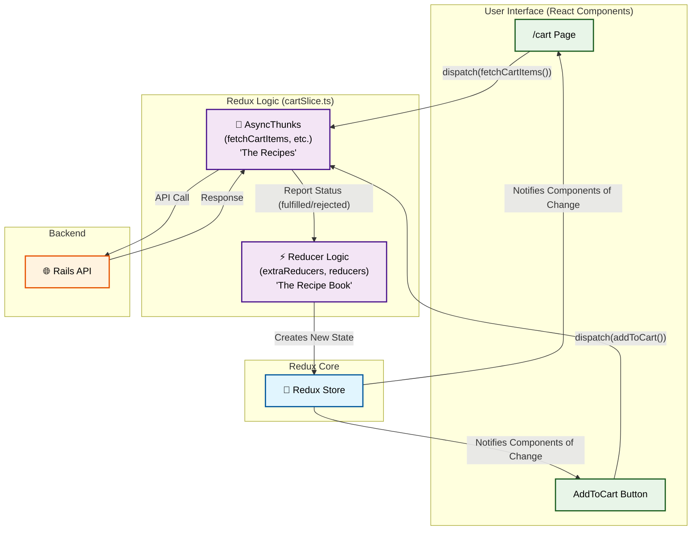
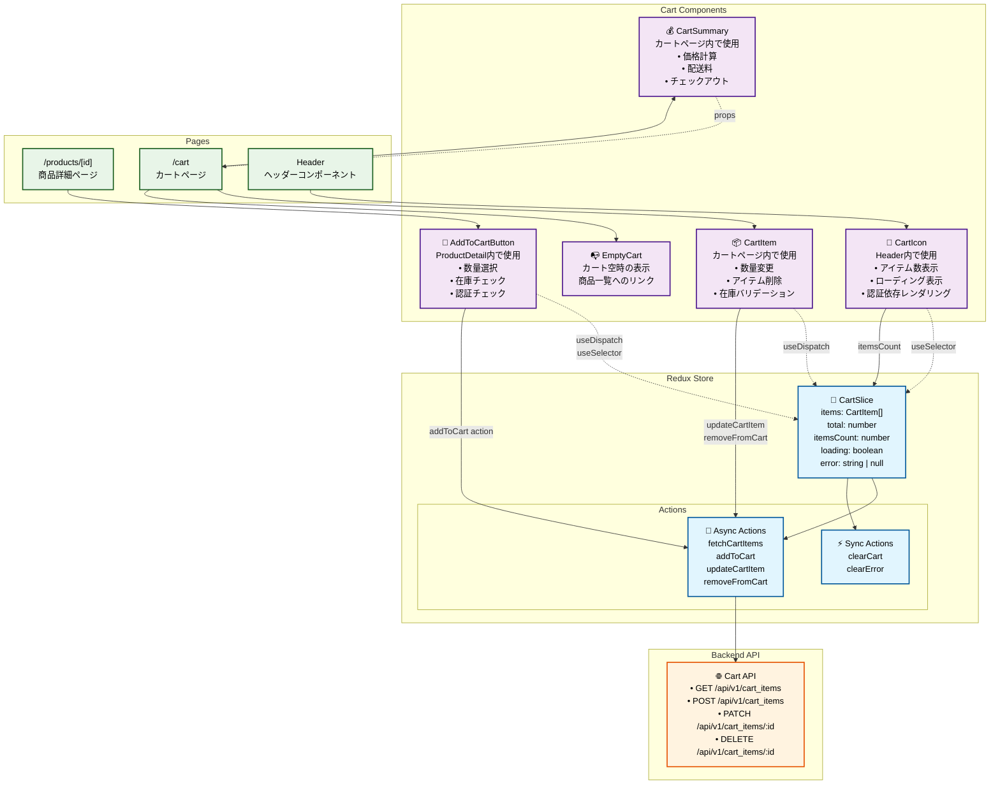

# Redux Deep Dive: A Practical Guide for the Cart Feature
# Redux詳細解説：カート機能で学ぶ実践ガイド

**Created**: 2025-06-28  
**Issue**: #005 Shopping Cart Implementation  
**Purpose**: This document provides a detailed explanation of the Redux Toolkit implementation for the shopping cart feature. It is designed to clarify the core concepts, data flow, and specific patterns used in `cartSlice.ts`, based on our recent discussions.
**目的**: このドキュメントは、ショッピングカート機能におけるRedux Toolkitの実装を詳細に解説するものです。最近の対話に基づき、`cartSlice.ts`で使われている主要な概念、データフロー、特定のパターンを明確にすることを目的としています。

---

## 0. The Core Data Flow of Redux Toolkit
## 0. Redux Toolkitの基本的なデータフロー

Before diving into the specifics of the cart, let's visualize the fundamental data flow of Redux Toolkit. This diagram shows how a user interaction in a component leads to a state update.
カートの具体的な話に入る前に、Redux Toolkitの基本的なデータフローを視覚化しましょう。この図は、コンポーネントでのユーザー操作が、どのように状態の更新につながるかを示しています。

---

## 1. The Big Picture: The Role of `cartSlice.ts`
## 1. 全体像：`cartSlice.ts`の役割

`cartSlice.ts` is the **headquarters for all cart-related state and logic**. Think of it as a dedicated "cart department" within our application. It's responsible for:
`cartSlice.ts`は、**カートに関する全ての状態（state）とロジック（logic）の司令部**です。アプリケーション内にある専門の「カート部門」と考えてください。このファイルの責任は以下の通りです。

- **Defining the Data**: What information does the cart need? (e.g., items, total price).
  **データの定義**: カートはどんな情報を持つべきか？（例：商品リスト、合計金額）
- **Defining the Logic**: How can this data be changed? (e.g., adding an item, clearing the cart).
  **ロジックの定義**: このデータはどうすれば変更できるか？（例：商品を追加する、カートを空にする）

This file encapsulates everything, so other parts of the app don't need to know the messy details. They just need to send a request to the "cart department".
このファイルが全てをカプセル化（ひとまとめに）しているため、アプリの他の部分は複雑な詳細を知る必要がありません。ただ「カート部門」に依頼を送るだけで済みます。

---

## 2. Inside the "Cart Department": A Breakdown of `cartSlice.ts`
## 2. 「カート部門」の内部：`cartSlice.ts`の分解

The `cartSlice.ts` file is built using several key tools from Redux Toolkit. Let's look at them one by one.
`cartSlice.ts`ファイルは、Redux Toolkitのいくつかの重要な道具を使って作られています。一つずつ見ていきましょう。

### 2.1. The Two Types of Logic: Sync vs. Async
### 2.1. 2種類のロジック：同期的 vs 非同期

This is the most important distinction to understand. The "cart department" handles two fundamentally different types of tasks.
これは理解すべき最も重要な違いです。「カート部門」は、根本的に異なる2種類のタスクを扱います。

- **Synchronous (Sync) Tasks 同期タスク**:
  - **What it is**: Simple, instant tasks that **do not** require communicating with the server.
    **概要**: サーバーとの通信を**必要としない**、即座に完了する単純なタスク。
  - **Example**: Clearing an error message from the screen.
    **例**: 画面からエラーメッセージを消す。
  - **Where it's written**: In the `reducers` section of `createSlice`.
    **記述場所**: `createSlice`の`reducers`セクション。

- **Asynchronous (Async) Tasks 非同期タスク**:
  - **What it is**: Complex tasks that **do** require communicating with the server, which takes time.
    **概要**: サーバーとの通信を**必要とする**、時間のかかる複雑なタスク。
  - **Example**: Fetching the cart contents from the database.
    **例**: データベースからカートの中身を取得する。
  - **Where it's written**: The task itself is defined using `createAsyncThunk`. How the state changes based on the task's result is defined in the `extraReducers` section.
    **記述場所**: タスク自体は`createAsyncThunk`で定義し、そのタスクの結果に応じて状態をどう変えるかは`extraReducers`セクションに記述します。

### 2.2. The Async Specialist: `createAsyncThunk`
### 2.2. 非同期の専門家：`createAsyncThunk`

`createAsyncThunk` is a tool specifically for defining async tasks. Think of it as writing a **"recipe for a task that involves the server"**.
`createAsyncThunk`は、非同期タスクを定義するための専門の道具です。**「サーバーが関わるタスクのレシピ」**を書くようなものだと考えてください。

When you define a task like `fetchCartItems`, `createAsyncThunk` automatically handles three stages of the process:
`fetchCartItems`のようなタスクを定義すると、`createAsyncThunk`はそのプロセスの3つの段階を自動的に管理してくれます。

1.  **`pending`**: "I've started the task." (e.g., "I'm on my way to the server.")
    「タスクを開始しました」。（例：「サーバーに向かっています」）
2.  **`fulfilled`**: "I've successfully completed the task." (e.g., "I got the data from the server!")
    「タスクが成功しました」。（例：「サーバーからデータを取得しました！」）
3.  **`rejected`**: "The task failed." (e.g., "The server returned an error.")
    「タスクが失敗しました」。（例：「サーバーがエラーを返しました」）

#### A Key Tool: `rejectWithValue`
#### 重要な道具：`rejectWithValue`
When a task fails, we often want to know *why*. `rejectWithValue` is a function that lets us send a **custom, meaningful error message** back from our async task. Instead of just knowing it failed, we can know it failed because "the item is out of stock."
タスクが失敗したとき、私たちはその*理由*を知りたいことが多いです。`rejectWithValue`は、非同期タスクから**カスタムの、意味のあるエラーメッセージ**を返すことができる関数です。単に失敗したと知るだけでなく、「在庫切れ」が原因で失敗した、ということを知ることができます。

### 2.3. The State Updater: `extraReducers` and the `builder.addCase` Pattern
### 2.3. 状態の更新役：`extraReducers`と`builder.addCase`パターン

`extraReducers` is where we define **how the state should change based on the results of our async tasks**. It acts like a "situation room" that listens for reports from `createAsyncThunk`.
`extraReducers`は、**非同期タスクの結果に応じて、状態をどう変更すべきか**を定義する場所です。`createAsyncThunk`からの報告を待つ「状況分析室」のように機能します。

- **`builder`**: A "craftsman" object provided by Redux Toolkit to help us build the reducer logic safely.
  リデューサーのロジックを安全に組み立てるのを手伝ってくれる、Redux Toolkit提供の「職人」オブジェクト。
- **`addCase`**: A method used by the `builder` to add a specific rule, like: "**In case** `fetchCartItems` is `fulfilled`, **do this** to the state."
  `builder`が使うメソッドで、「**もし**`fetchCartItems`が`fulfilled`になった**場合は**、状態に対して**この処理をしなさい**」という具体的なルールを追加します。

This pattern is the modern, standard way to handle async state changes because it works perfectly with TypeScript, making our code safer and easier to write.
このパターンは、TypeScriptと完璧に連携し、コードをより安全かつ簡単に書けるようにするため、非同期の状態変更を扱うための現代的で標準的な方法です。

---

## 3. The Unbreakable Rule: The Redux Data Flow (Cafe Analogy)
## 3. 破れないルール：Reduxのデータフロー（カフェの例え）

Redux enforces a strict one-way data flow. This makes our application predictable and easier to debug. Let's revisit the cafe analogy.
Reduxは厳格な一方通行のデータフローを強制します。これにより、アプリケーションは予測可能でデバッグしやすくなります。カフェの例えで再確認しましょう。

**The Cast:**
- **You (The Customer)**: The React Component
- **The Waiter**: The `dispatch` function
- **The Order Slip**: The Action object
- **The Central Counter**: The Redux Store
- **The Kitchen**: The Reducer (`cartSlice.reducer`)
- **The Recipe Book**: The Reducer's logic (e.g., `builder.addCase(...)`)
- **The "Order Ready" Screen**: The notification from the Store to the Component

**The Flow:**
1.  **You (Component)** decide you want something. You can't go into the kitchen yourself.
    **あなた（コンポーネント）**は何かを欲します。しかし、自分でキッチンに入ることはできません。
2.  You call the **Waiter (`dispatch`)** and place an order using an **Action** (e.g., `addToCart()`).
    あなたは**ウェイター（`dispatch`）**を呼び、**アクション**（例：`addToCart()`）を使って注文します。
3.  The Waiter writes it on an **Order Slip (Action Object)** and takes it to the **Central Counter (Store)**.
    ウェイターはそれを**注文票（アクションオブジェクト）**に書き、**中央カウンター（ストア）**に持っていきます。
4.  The Store passes the order to the **Kitchen (Reducer)**.
    ストアは注文を**キッチン（リデューサー）**に渡します。
5.  The Kitchen looks at the order and follows the **Recipe Book (Reducer Logic)** to prepare a **brand new dish (New State)**. It never modifies the old dish.
    キッチンは注文を見て、**レシピブック（リデューサーのロジック）**に従い、**全く新しい料理（新しい状態）**を準備します。古い料理を改造することは決してありません。
6.  The new state is placed in the Store, and the **"Order Ready" Screen (Component)** is updated, letting you know your order is ready.
    新しい状態がストアに置かれ、**「準備完了」スクリーン（コンポーネント）**が更新され、注文の準備ができたことをあなたに知らせます。

### The "Menu" vs. The "Recipe Book"
### 「メニュー表」 vs 「レシピブック」

This was a key point of confusion.
ここは特に混乱しがちな重要なポイントでした。

- `export const { clearCart } = cartSlice.actions;`
  - This is the **Menu (メニュー表)**. It's a list of "order names" that the Component can use. The Component only needs to know the name of the order, not how it's made.
  - これはコンポーネントが使える「注文名」のリストです。コンポーネントは、それがどう作られるかを知る必要はなく、注文の名前だけを知っていれば良いのです。

- `export default cartSlice.reducer;`
  - This is the **Recipe Book (レシピブック)**. It contains all the detailed instructions for how to "cook" every possible order. This is given to the Store to set up the kitchen.
  - これは、ありえる全ての注文を「調理」するための詳細な指示が全て書かれています。これはストアに渡され、キッチンをセットアップするために使われます。

---

## 4. Architecture Diagram for the Cart Feature
## 4. カート機能のアーキテクチャ図

This diagram illustrates the **dynamic process flow** of the application. It shows how data moves between different parts of the system when an action, such as adding an item to the cart, occurs.
この図は、アプリケーションの**動的なプロセスフロー**を示しています。カートに商品を追加するなどのアクションが発生した際に、システムの各パーツ間でデータがどのように移動するかを表します。

The following diagram shows how all these pieces fit together for the cart feature.

## 5. Appendix: Detailed Component Architecture Diagram
## 5. 付録：詳細なコンポーネントアーキテクチャ図

This diagram provides a **static structural map** of all components. It shows what the cart feature is made of and how the individual components, pages, the Redux store, and the backend API are interconnected.
この図は、全てのコンポーネントの**静的な構造マップ**です。カート機能がどのような部品で構成されているか、そして個々のコンポーネント、ページ、Reduxストア、バックエンドAPIが互いにどう接続されているかを示します。

