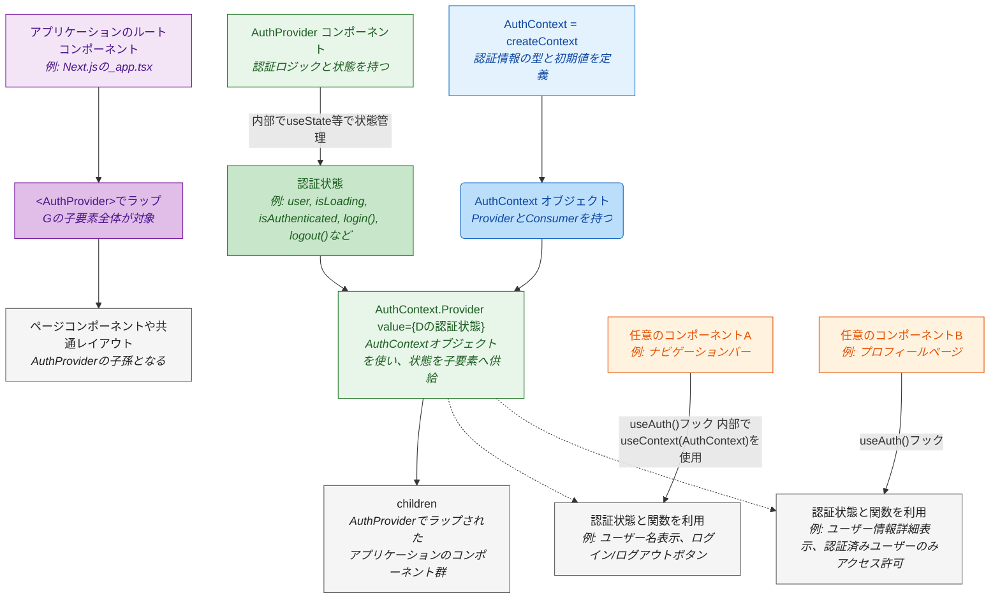

# React Context のフロー図

このドキュメントでは、認証コンテキストのデータフローを図示します。

## 認証コンテキストのデータフロー

## 図の詳細解説

この図は、ReactのContext APIを利用して認証情報をアプリケーション全体で共有するための一般的なパターンを示しています。各ステップを詳しく見ていきましょう。

### 1. コンテキストの作成 (`AuthContext.tsx`内)

*   **`AuthContext = createContext(defaultValue)`**:
    *   これは認証情報を共有するための「場」または「通路」を作る最初のステップです。`createContext` 関数は、`AuthContext` という名前の特別なオブジェクトを生成します。このオブジェクトには、後述する `Provider` と、コンポーネントがこのコンテキストの値を読み取るための仕組みが含まれています。
    *   `defaultValue`（デフォルト値）: これは、`Provider` が見つからない場合に `useContext` が返す値です。通常、アプリケーションの構造上 `Provider` が必ず存在するように設計するため、このデフォルト値が直接使われることは少ないですが、型定義のためや、万が一のフォールバックとして設定されます。例えば、未認証状態を示すオブジェクト（`{ user: null, isAuthenticated: false, ... }`など）を定義します。
    *   この段階では、まだ具体的なデータ（誰がログインしているかなど）は入っていません。あくまで「こういう型の情報（ユーザー情報、ログイン状態、ログイン関数など）を扱いますよ」という設計図や契約を定義しているようなものです。

### 2. プロバイダーの定義 (`AuthProvider` コンポーネント内)

*   **`AuthProvider` コンポーネント**:
    *   このコンポーネントが、実際に認証状態を管理し、その情報を配下のコンポーネントに「供給（Provide）」する責任を持ちます。
    *   **状態管理**: `AuthProvider` の内部では、Reactの `useState` フックなどを使って、現在のユーザー情報 (`user`)、認証処理中かどうか (`isLoading`)、認証済みかどうか (`isAuthenticated`)、エラー情報 (`error`) などを状態として保持します。また、ログイン処理 (`login`)、新規登録処理 (`register`)、ログアウト処理 (`logout`) といった、認証に関わる関数もここで定義されます。これらの関数は、API呼び出しなどを行い、その結果に応じて内部の状態を更新します。
*   **`AuthContext.Provider value={...状態...}`**:
    *   `AuthProvider` コンポーネントは、そのJSXの中で `AuthContext.Provider` を使います。これは、ステップ1で作成した `AuthContext` オブジェクトが持つ特別なコンポーネントです。
    *   `value` プロパティ: ここに、共有したい認証状態（`user`オブジェクト、`isAuthenticated`フラグ、`login`関数などを含むオブジェクト）を渡します。この `value` に渡された情報が、この `Provider` の配下にあるコンポーネントからアクセス可能になります。
    *   `children`: `AuthProvider` でラップされた子コンポーネント群がここにレンダリングされます。これにより、`AuthProvider` はその子孫コンポーネントに対して認証情報を提供できます。

### 3. アプリケーション全体への適用 (例: `_app.tsx` や `App.tsx`)

*   **アプリケーションのルートコンポーネントでラップ**:
    *   作成した `AuthProvider` コンポーネントを使って、アプリケーションのルートに近いコンポーネント（例えばNext.jsでは `pages/_app.tsx` のカスタムAppコンポーネント、Create React Appでは `src/App.tsx` など）全体、あるいは認証情報が必要な範囲のコンポーネント群を囲みます。
    *   例: `<AuthProvider><MyApp /></AuthProvider>` のようにします。
    *   これにより、`MyApp` 以下の全てのコンポーネントが、`AuthProvider` によって提供される認証情報にアクセスできるようになります。アプリケーションのどこからでも「現在のユーザーは誰か」「ログインしているか」といった情報を取得したり、ログイン・ログアウト処理を呼び出したりできるようになるのです。

### 4. コンシューマー (任意のコンポーネントでの利用)

*   **`useAuth()` カスタムフック (内部で `useContext(AuthContext)` を使用)**:
    *   認証情報を利用したいコンポーネント（例えば、ナビゲーションバーにユーザー名を表示したい、特定のページへのアクセスを認証済みユーザーに限定したいなど）では、`useContext` フックを使って `AuthContext` から情報を取り出します。
    *   通常、利便性のために `useContext(AuthContext)` をラップしたカスタムフック（図では `useAuth()`）を作成します。これにより、コンポーネント側では `const { user, login, isAuthenticated } = useAuth();` のようにシンプルに認証状態や関数を取得できます。
    *   `useContext` は、呼び出されたコンポーネントから最も近い上位の `<AuthContext.Provider>` を探し、その `value` プロパティに渡されたオブジェクトを返します。
*   **状態と関数の利用**:
    *   取得した認証状態（`user` や `isAuthenticated`）に基づいて、表示内容を切り替えたり、特定の操作を許可/禁止したりします。
    *   取得した関数（`login` や `logout`）をユーザーのアクション（ボタンクリックなど）に紐付けて実行します。

## このパターンの重要なポイントとメリット

*   **「パイプ」としての `AuthContext`**:
    *   `AuthContext` オブジェクト自体はデータを持たず、`Provider`（供給者）と `Consumer`（利用者、`useContext`経由）を繋ぐ「パイプ」や「通信路」のような役割を果たします。
*   **データの実体は `AuthProvider`**:
    *   実際の認証データ（ユーザー情報、ログイン状態など）や認証ロジックは `AuthProvider` コンポーネントが一元的に管理しています。これが「Single Source of Truth（信頼できる唯一の情報源）」となります。
*   **`useAuth()` による容易なアクセス**:
    *   カスタムフック `useAuth()` を用意することで、どのコンポーネントからでも簡潔な記述で認証情報にアクセスでき、コードの可読性と再利用性が向上します。
*   **プロップスのバケツリレーの回避**:
    *   Context API を使う最大のメリットの一つは、「プロップスのバケツリレー」を回避できる点です。深い階層にあるコンポーネントに認証情報を渡すために、中間にある多数のコンポーネントを経由してpropsを渡し続ける必要がなくなります。これにより、コンポーネント間の結合度が下がり、コードがクリーンになります。
*   **関心の分離**:
    *   認証関連のロジックと状態管理を `AuthProvider` に集約することで、他のコンポーネントは表示やユーザーインタラクションといった自身の責務に集中できます。
*   **再レンダリングの最適化**:
    *   Contextの値が変更されると、そのContextを利用しているコンポーネントは再レンダリングされます。`AuthProvider` の `value` に渡すオブジェクトをメモ化する（`useMemo` を使うなど）ことで、不要な再レンダリングを抑制し、パフォーマンスを最適化することも考慮点となります。

この詳細な解説が、React Context API を用いた認証フローの理解を深める助けになれば幸いです。
