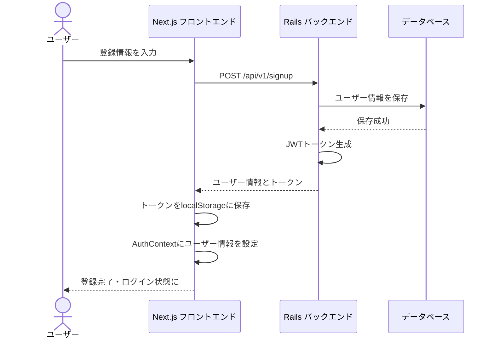
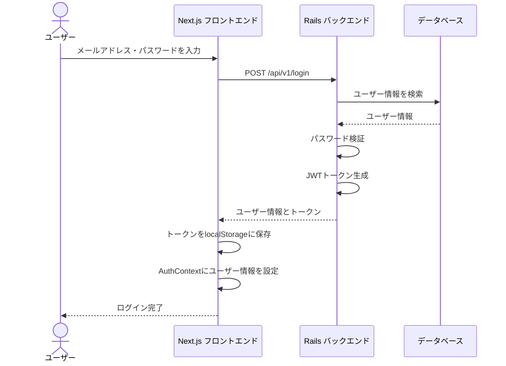
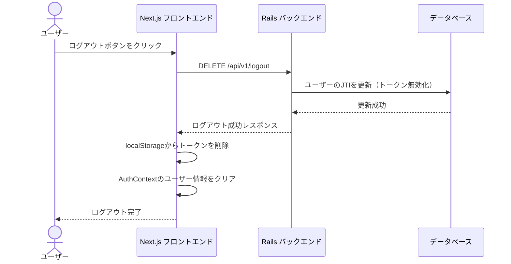
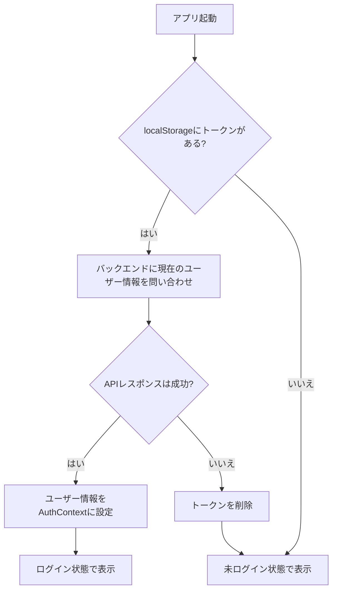
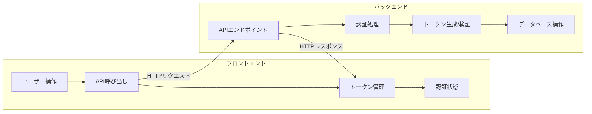

# 認証フローの図解

このドキュメントでは、ECサイトにおけるユーザー認証の流れを図解します。

## 目次

1. [ユーザー登録フロー](#ユーザー登録フロー)
2. [ログインフロー](#ログインフロー)
3. [ログアウトフロー](#ログアウトフロー)
4. [アプリケーション起動時の認証チェック](#アプリケーション起動時の認証チェック)
5. [JWT認証の全体像](#jwt認証の全体像)

## ユーザー登録フロー

## ログインフロー

## ログアウトフロー

## アプリケーション起動時の認証チェック

## JWT認証の全体像

## JWT認証の技術的詳細

### JWTとは

JWT（JSON Web Token）は、当事者間で安全に情報を送信するためのコンパクトで自己完結型の方法です。この情報は、デジタル署名されているため、検証および信頼できます。

### JWTの構造

JWTは、ドットで区切られた3つの部分からなる文字列です：

1. **ヘッダー** - トークンのタイプとアルゴリズム
2. **ペイロード** - クレーム（データ）
3. **署名** - トークンの検証に使用

例：`xxxxx.yyyyy.zzzzz`

### JTIによるトークン無効化

JTI（JWT ID）は、トークンに一意の識別子を提供し、そのトークンを無効化する機能を可能にします。

1. ユーザーがログインすると、一意のJTI値がユーザーレコードに保存されます
2. このJTI値がトークンのペイロードに含まれます
3. ユーザーがログアウトすると、データベース内のJTI値が更新されます
4. 古いJTI値を持つトークンは無効と見なされ、認証に失敗します

これにより、ユーザーがログアウトした後でも、以前発行されたトークンが使用できなくなります。
