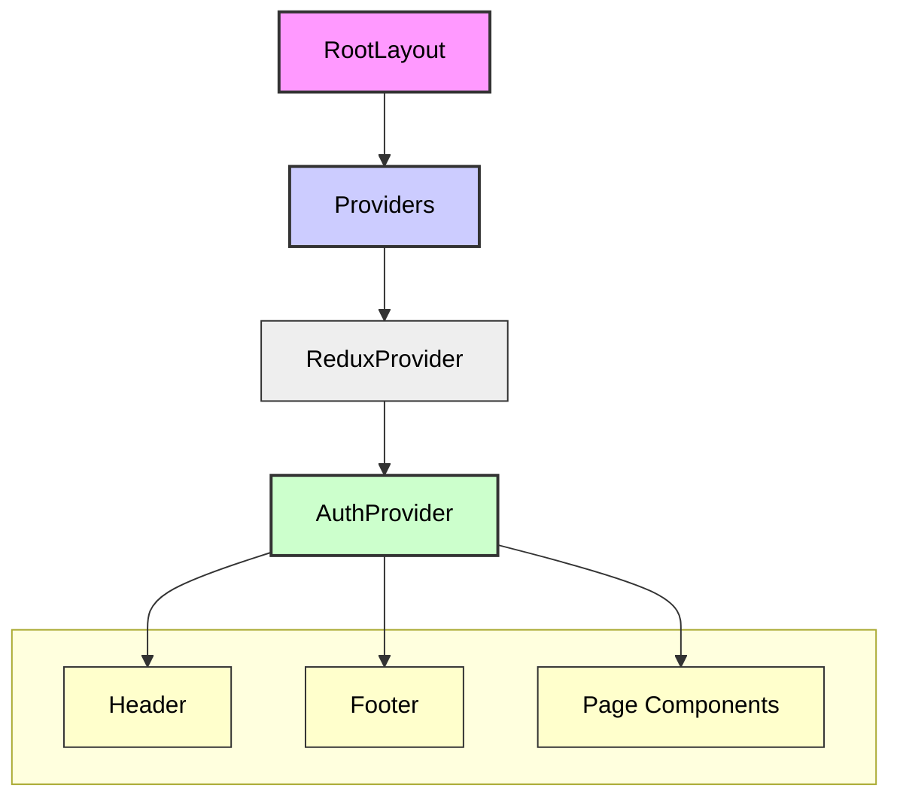

# Frontend Context Providers Data Flow
# フロントエンド Context Providerのデータフロー

## 1. Overview / 概要

This document explains the data flow using Context API in a Next.js frontend application, focusing on the `Providers` and `AuthProvider` components. It particularly highlights how authentication state and related functionalities are provided and utilized throughout the application.

このドキュメントでは、Next.jsフロントエンドアプリケーションにおける`Providers`コンポーネントと`AuthProvider`コンポーネントを中心とした、Context APIを利用したデータフローについて説明します。特に、認証状態や関連機能がアプリケーション全体でどのように提供され、利用されるかに焦点を当てます。

## 2. Related Components / 関連コンポーネント

The main related files and components are as follows:
主要な関連ファイルとコンポーネントは以下の通りです。

-   **`app/layout.tsx`**: The root layout of the entire application where the `Providers` component is used.
-   **`app/layout.tsx`**: アプリケーション全体のルートレイアウト。ここで`Providers`が使用されます。

-   **`app/providers.tsx`**: A wrapper component that consolidates multiple context providers including `AuthProvider` and Redux's `Provider`.
-   **`app/providers.tsx`**: `AuthProvider`やReduxの`Provider`など、複数のContextプロバイダーをまとめるラッパーコンポーネント。

-   **`contexts/AuthContext.tsx`**: Defines `AuthContext` and `AuthProvider` which provide authentication-related state (user information, authentication status) and functions (login, logout, etc.).
-   **`contexts/AuthContext.tsx`**: 認証関連の状態（ユーザー情報、認証ステータス）と関数（ログイン、ログアウトなど）を提供する`AuthContext`と`AuthProvider`を定義。

-   **Page components and common components (e.g., `Header.tsx`)**: Components that consume authentication information from `AuthContext`.
-   **各ページコンポーネントや共通コンポーネント（例: `Header.tsx`）**: `AuthContext`から認証情報を消費するコンポーネント。


## 3. Data Flow and Component Hierarchy / データフローとコンポーネント階層

When the application starts, the Context is provided and data flows as follows:

アプリケーションの起動時、以下のような流れでContextが提供され、データが流れます。

1.  **`RootLayout` (`app/layout.tsx`)**:
     The entry point of the application where the `Providers` component is used to provide Context throughout the entire application.
     アプリケーションのエントリーポイント。ここで`Providers`コンポーネントが使用され、アプリケーション全体にContextが提供されます。

    ```tsx
    // app/layout.tsx
    import { Providers } from './providers';
    import Header from '@/components/layout/Header';
    import Footer from '@/components/layout/Footer';

    export default function RootLayout({
      children,
    }: {
      children: React.ReactNode;
    }) {
      return (
        <html lang="ja">
          <body>
            <Providers> {/* Providersで全体をラップ */}
              <div className="min-h-screen flex flex-col">
                <Header />
                <main className="flex-grow">
                  {children} {/* Page components will be rendered here */}
                </main>
                <Footer />
              </div>
            </Providers>
          </body>
        </html>
      );
    }
    ```

2.  **`Providers` (`app/providers.tsx`)**:
     This component provides multiple context providers used in the application (in this case, Redux's `Provider` and `AuthProvider`). The `AuthProvider` is dynamically imported using `next/dynamic` to ensure it's only loaded on the client side.
     このコンポーネントは、アプリケーションで使用する複数のContextプロバイダー（この場合はReduxの`Provider`と`AuthProvider`）をまとめて提供します。`AuthProvider`はクライアントサイドでのみ読み込まれるように`next/dynamic`を使用して動的インポートされています。

    ```tsx
    // app/providers.tsx
    'use client';

    import { Provider as ReduxProvider } from 'react-redux';
    import { store } from '@/store/store';
    import dynamic from 'next/dynamic';

    const AuthProvider = dynamic(
      () => import('@/contexts/AuthContext').then(mod => mod.AuthProvider),
      { ssr: false } // Disable server-side rendering
    );

    export function Providers({ children }: { children: React.ReactNode }) {
      return (
        <ReduxProvider store={store}>
          <AuthProvider> {/* Wrap children with AuthProvider */}
            {children}
          </AuthProvider>
        </ReduxProvider>
      );
    }
    ```

3.  **`AuthProvider` (`contexts/AuthContext.tsx`)**:
     Provides authentication-related state (user information, loading state, error state) and functions to update that state (`login`, `logout`, `register`, `checkAuth`, etc.). This provider is accessible from anywhere in the application via the `useContext` hook.
     認証関連の状態（ユーザー情報、ローディング状態、エラー状態）と、その状態を更新するための関数（`login`、`logout`、`register`、`checkAuth`など）を提供します。このプロバイダーは`useContext`フックを通じてアプリケーションのどこからでもアクセス可能です。

    ```tsx
    // contexts/AuthContext.tsx
    // ... (AuthContextの定義やuseState, useEffectなど)

    const AuthProvider = ({ children }: AuthProviderProps) => {
      // Save user data to state
      setUser(user);
      // Set as authenticated
      setIsAuthenticated(true);
      // Clear any errors
      setError(null);

      const value = {
        user,
        isAuthenticated: !!user,
        isLoading,
        error,
        login,
        register,
        logout,
        checkAuth
      };

      return (
        <AuthContext.Provider value={value}> {/* Contextの値を提供 */}
          {children}
        </AuthContext.Provider>
      );
    };
    ```

4.  **Consumer Components (例: `Header.tsx`)**:
     Uses the `useAuth` hook to access authentication state and functions from `AuthContext`. This allows showing/hiding UI elements based on authentication status and calling authentication functions.
     `useAuth`フックを使用して`AuthContext`から認証状態や認証関数にアクセスします。これにより、認証状態に基づいたUIの表示・非表示や、認証機能を呼び出すことができます。

    ```tsx
    // Example: Header.tsx
    import { useAuth } from '@/contexts/AuthContext';

    function Header() {
      const { isAuthenticated, user, logout } = useAuth();

      return (
        <header>
          {isAuthenticated ? (
            <div>
              <span>Welcome, {user?.name}!</span>
              <button onClick={logout}>Logout</button>
            </div>
          ) : (
            <Link href="/login">Login</Link>
          )}
        </header>
      );
    }
    ```

## 4. Data Flow Diagram (Mermaid.js) / データフロー図 (Mermaid.js)

The following diagram illustrates the component hierarchy and data flow of the Context:
以下は、コンポーネント階層とContextのデータフローを図示したものです。



This diagram shows that starting from `RootLayout`, the `Providers` component wraps the `ReduxProvider` and `AuthProvider`. It illustrates how the `AuthProvider` delivers the authentication context to consumers such as `Header`, `Footer`, and other page components. Similarly, the `ReduxProvider` provides access to the Redux store.
この図は、`RootLayout`から始まり、`Providers`コンポーネントが`ReduxProvider`と`AuthProvider`をラップしていることを示しています。そして、`AuthProvider`が認証コンテキストを`Header`、`Footer`、およびその他のページコンポーネントなどのコンシューマーに提供する流れを表しています。同様に`ReduxProvider`もReduxストアへのアクセスを提供します。

## 5. Summary / まとめ

This structure encapsulates authentication-related state and logic in `AuthContext`, making it easily accessible from any component in the application via the `useAuth` hook. The `Providers` component is a convenient pattern for centrally managing multiple context providers.
この構造により、認証関連の状態とロジックは`AuthContext`にカプセル化され、アプリケーション内の任意のコンポーネントから`useAuth`フックを通じて容易にアクセスできます。`Providers`コンポーネントは、複数のContextプロバイダーを一元的に管理するための便利なパターンです。
