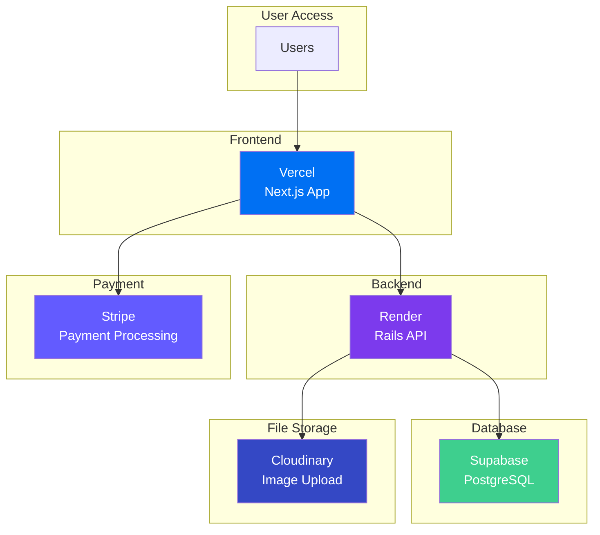

# Production Architecture / 本番環境アーキテクチャ

```mermaid
graph TB
    subgraph "User Access"
        U[Users]
    end
    
    subgraph "Frontend"
        V[Vercel<br/>Next.js App]
    end
    
    subgraph "Backend"
        R[Render<br/>Rails API]
    end
    
    subgraph "Database"
        S[Supabase<br/>PostgreSQL]
    end
    
    subgraph "File Storage"
        C[Cloudinary<br/>Image Upload]
    end
    
    subgraph "Payment"
        ST[Stripe<br/>Payment Processing]
    end
    
    U --> V
    V --> R
    R --> S
    R --> C
    V --> ST
    
    style V fill:#0070f3,color:#fff
    style R fill:#7c3aed,color:#fff
    style S fill:#3ecf8e,color:#fff
    style C fill:#3448c5,color:#fff
    style ST fill:#635bff,color:#fff
```
