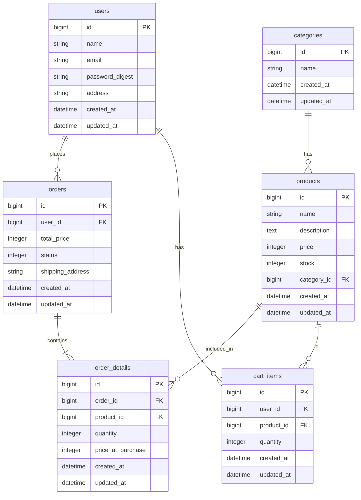

# Portfolio EC Site ER Diagram

```mermaid
erDiagram
    users {
        bigint id PK
        string name
        string email
        string password_digest
        string address
        datetime created_at
        datetime updated_at
    }

    products {
        bigint id PK
        string name
        text description
        integer price
        integer stock
        bigint category_id FK
        datetime created_at
        datetime updated_at
    }

    categories {
        bigint id PK
        string name
        datetime created_at
        datetime updated_at
    }

    orders {
        bigint id PK
        bigint user_id FK
        integer total_price
        integer status
        string shipping_address
        datetime created_at
        datetime updated_at
    }

    order_details {
        bigint id PK
        bigint order_id FK
        bigint product_id FK
        integer quantity
        integer price_at_purchase
        datetime created_at
        datetime updated_at
    }

    cart_items {
        bigint id PK
        bigint user_id FK
        bigint product_id FK
        integer quantity
        datetime created_at
        datetime updated_at
    }

    users ||--o{ orders : "places"
    users ||--o{ cart_items : "has"

    orders ||--|{ order_details : "contains"
    products ||--o{ order_details : "included_in"
    products ||--o{ cart_items : "in"

    categories ||--o{ products : "has"

```
